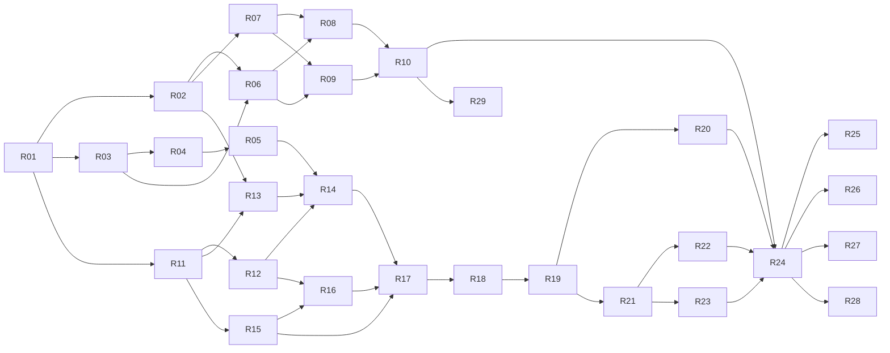

# Routes — Plan of Action

Related: [BRD](brd.md) · [Technical design](technical-design.md) · [UX sketch](ux-sketch.md) · [Test plan](test-plan.md) · [Agent rules](../AGENTS.md)

The work is split into GitHub issues with stable IDs:

- **R-xx** issues are for the coding agent (label `agent`).
- **H-xx** issues are for a human (label `needs-human`). They involve accounts, credentials, legal review or real devices.

The agent works through R-issues **in the order below**, one issue per PR. An issue may start only when everything in its "Blocked by" list is merged. Each issue records its dependencies twice: in a "Blocked by" section of the body, and as GitHub issue dependencies. The agent merges its own PRs once CI is green; there is no human review step.

## Principles behind the order

1. **Logic before screens.** The ranking and cost rules are the product's core and its biggest risk. They come first, as a pure package with exhaustive tests.
2. **Mock first.** The proxy's mock provider and fixtures exist before any screen. The whole app can then be built and tested with no Google keys, Apple account or device. Human setup (H-issues) runs in parallel and only gates the final release work.
3. **Contracts before callers.** `api-types` lands before the proxy and app use it.
4. **Thin vertical slices.** Each screen issue includes its states (loading, error, offline) and tests, not a later "polish" pass.
5. **CI from day one.** Every PR must keep lint, typecheck, unit, integration and component tests green. E2E joins in phase 5.

## Sequence

| # | ID | Title | Phase | Blocked by |
|---|---|---|---|---|
| 1 | R-01 | Monorepo scaffold and CI | 0 Foundation | — |
| 2 | R-02 | `api-types`: proxy contract schemas | 0 Foundation | R-01 |
| 3 | R-03 | routing-core: polyline, geometry and overlap | 1 Core logic | R-01 |
| 4 | R-04 | routing-core: cost, ranking, dedupe, top three, differences | 1 Core logic | R-03 |
| 5 | R-05 | routing-core: formatters and display strings | 1 Core logic | R-04 |
| 6 | R-06 | Provider fixtures and fixture generator | 2 Proxy | R-02, R-03 |
| 7 | R-07 | Proxy skeleton: server, config, errors, validation, logging, Docker | 2 Proxy | R-02 |
| 8 | R-08 | Proxy `POST /routes` with Google and mock providers | 2 Proxy | R-06, R-07 |
| 9 | R-09 | Proxy places autocomplete and details | 2 Proxy | R-06, R-07 |
| 10 | R-10 | Proxy caching and per-device rate limits | 2 Proxy | R-08, R-09 |
| 11 | R-11 | Expo app scaffold: router, config, theme, i18n, test setup | 3 App foundation | R-01 |
| 12 | R-12 | On-device storage (SQLite) | 3 App foundation | R-11 |
| 13 | R-13 | API client, query hooks and network status | 3 App foundation | R-02, R-11 |
| 14 | R-14 | Trip state and ranked routes | 3 App foundation | R-05, R-12, R-13 |
| 15 | R-15 | Location: permission, current position, reverse geocode | 3 App foundation | R-11 |
| 16 | R-16 | Screen 1: Onboarding | 4 Screens | R-12, R-15 |
| 17 | R-17 | Screen 2: Home | 4 Screens | R-14, R-15, R-16 |
| 18 | R-18 | Screen 3: Search, and S2 Set Home/Work | 4 Screens | R-17 |
| 19 | R-19 | Screen 4: Results sheet and route cards | 4 Screens | R-18 |
| 20 | R-20 | Screen 4: Results map | 4 Screens | R-19 |
| 21 | R-21 | Screen 5: Route detail | 4 Screens | R-19 |
| 22 | R-22 | S1 Edit vehicle and Cheapest vehicle prompt | 4 Screens | R-21 |
| 23 | R-23 | Google Maps handoff, S3 sheet and Share | 4 Screens | R-21 |
| 24 | R-24 | Maestro E2E suite and macOS CI job | 5 Hardening | R-10, R-20, R-22, R-23 |
| 25 | R-25 | Accessibility and dark-mode pass | 5 Hardening | R-24 |
| 26 | R-26 | Sentry, privacy manifest and privacy docs | 5 Hardening | R-24 |
| 27 | R-27 | App Attest: Expo module and proxy verification | 5 Hardening | R-10, R-24 |
| 28 | R-28 | EAS build profiles and app build workflow | 6 Release prep | R-24 |
| 29 | R-29 | Proxy deploy workflow (Cloud Run) | 6 Release prep | R-10 |

With one agent, follow the numbered order. If an issue gets labelled `blocked`, skip to the lowest-numbered issue whose blockers are all closed. For example, if R-06 is stuck, R-07 and R-11 to R-15 can still proceed.

## Human track (parallel)

| ID | Title | Needed before |
|---|---|---|
| H-01 | Confirm proposed values and business model | Beta (values are configurable constants) |
| H-02 | Google Cloud projects, APIs, keys and budgets | H-07, R-29 deploy, live testing |
| H-03 | Apple Developer, App Store Connect, Expo/EAS accounts and GitHub secrets | R-28 builds, R-27 device check |
| H-04 | Cloud Run deploy infrastructure | R-29 deploy runs |
| H-05 | Sentry project and DSN | R-26 events actually sent |
| H-06 | Legal review of Google Maps Platform terms | Beta |
| H-07 | Live-data validation and overlap tuning | Beta |
| H-08 | Device QA, TestFlight beta and App Store submission | Launch |

None of the R-issues wait on an H-issue to be **built and tested**. Each R-issue that integrates with an external service must work in mock or no-secret mode. Its CI jobs must skip cleanly when secrets are absent.

## Milestones

| Milestone | Done when |
|---|---|
| **A: Core logic** | R-01 to R-05 merged. All `RC-` tests pass. |
| **B: Proxy (mock)** | R-06 to R-10 merged. `npm run proxy:dev` serves every fixture. |
| **C: App works end to end in mock mode** | R-11 to R-23 merged. Every screen is navigable in the simulator. |
| **D: Verified** | R-24 to R-27 merged. E2E is green in CI, with accessibility checks. |
| **E: Release-ready** | R-28, R-29 and H-01 to H-07 done. The staging build is on TestFlight and talks to the staging proxy with live data. |
| **F: Launch** | H-08 done. |

## Progress tracking

A pinned tracking issue lists every issue in this order as a checklist. The agent ticks an item when it merges the PR. When an issue is blocked by something outside the agent's control, the agent:

1. comments on the issue with what's missing,
2. adds the `blocked` label,
3. moves on to the next unblocked issue in the sequence.
