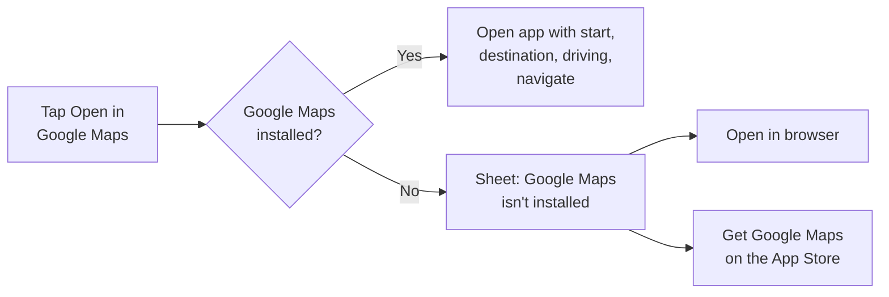

# Routes — Business Requirements Document

Oct 5, 2026 · @Tony L

Related: [Technical design](technical-design.md) · [UX sketch](ux-sketch.md)

## Overview

Routes is an iOS app that shows drivers three route options to a destination, ranked by either time or cost, and hands the chosen route to Google Maps for navigation.

**Problem.** Mainstream map apps lead with one "best" route, usually the fastest. Drivers who want to avoid tolls or spend less have to dig through settings and compare alternatives by hand, and the apps rarely show what a route actually costs.

**Solution.** Routes puts time and money side by side. The user sets a start (current location by default) and a destination, picks Fastest or Cheapest, and sees three routes on a map with duration, distance, tolls and estimated fuel cost. Picking one opens Google Maps for turn-by-turn directions.

**Vision.** The quickest way to answer "is the toll road worth it today?" before every drive.

## Goals, non-goals and success metrics

v1 succeeds if users can compare three routes and reach Google Maps in under 30 seconds, and come back to do it again.

**Goals**

- Let a driver compare three routes by time or by cost in one screen.
- Make trip cost visible: tolls plus estimated fuel, per route.
- Hand off to Google Maps in one tap from route detail.
- Ship v1 on iOS without building a navigation engine.

**Non-goals (v1)**

- In-app turn-by-turn navigation.
- Keeping Google Maps on the exact route Routes showed. Google may re-route; that is acceptable.
- Walking, cycling and transit modes.
- Android, iPad-optimized and web versions.

**Success metrics** (targets to be confirmed)

| Metric | Definition | Target |
|---|---|---|
| Time to routes | App open to three routes shown, with a recent destination | [TARGET] s |
| Handoff rate | Sessions with routes shown that tap Open in Google Maps | [TARGET] % |
| Cheapest usage | Sessions that switch to Cheapest at least once | [TARGET] % |
| 30-day retention | Users who plan a trip again within 30 days | [TARGET] % |
| Route load success | Route requests returning 3 routes without error | [TARGET] % |

## Target users

The primary user is a car commuter in a region with toll roads who weighs time against money on routine trips.

| Persona | Situation | What they need from Routes |
|---|---|---|
| Daily commuter | Same trip most weekdays; tolled express lanes are an option | Know each day whether the toll saves enough time to be worth it |
| Budget-conscious driver | Avoids tolls by habit, watches fuel spend | The cheapest reasonable route, with the time cost made clear |
| Occasional traveler | Unfamiliar trip, e.g. to an airport or station | Three sensible options fast, then hand off to a navigator they trust |

All personas already use Google Maps for navigation; Routes sits in front of it as the decision step.

## Scope

v1 is a route-comparison app for iPhone drivers; navigation stays in Google Maps.

| Area | v1 (in scope) | Later phases |
|---|---|---|
| Start point | Current location via iOS Location Services; manual address entry | Pick start on map |
| Destination | Address and place search with autocomplete; recents; saved Home and Work | Choose on map; contacts and calendar suggestions |
| Route options | Three routes, ranked Fastest or Cheapest | Custom avoidances (highways, ferries); depart-at and arrive-by times; time cap on Cheapest results |
| Cost | Tolls plus estimated fuel from a simple vehicle profile | Live fuel prices by region; EV charging cost; toll-tag discounts |
| Handoff | Open in Google Maps; browser or App Store if the app is missing | Apple Maps and Waze handoff; in-app navigation |
| Sharing | Share route summary via the iOS share sheet | Live ETA sharing |
| Platform | iPhone, iOS 16.0+ (*proposed*; the current Expo SDK's minimum if higher), English, US | iPad, Android, more locales and currencies |

Accounts are out of scope for v1. Recents, saved places and the vehicle profile live on the device.

## User stories

Each story maps to a screen in the [UX sketch](ux-sketch.md): main screens 1–5 and supporting screens S1–S3.

| ID | As a driver, I want to… | So that… | Screen |
|---|---|---|---|
| US-1 | Have my start filled in from my location | I only need to type where I'm going | 1, 2 |
| US-2 | Enter a start address by hand | I can plan trips from elsewhere, or without sharing location | 1, 2 |
| US-3 | Find a destination by typing part of a name or address | I don't need the exact address | 3 |
| US-4 | Reuse recent and saved destinations | Repeat trips take one tap | 2, S2 |
| US-5 | See three routes on a map with time, distance and cost | I can compare them at a glance | 4 |
| US-6 | Switch between Fastest and Cheapest | I can decide if saving money is worth the extra minutes | 4 |
| US-7 | See how each route compares to the top pick | The trade-off is explicit, e.g. "5 min slower · saves $3.65" | 4 |
| US-8 | See a route's toll and fuel breakdown and main steps | I trust the numbers before I leave | 5 |
| US-9 | Open my chosen route in Google Maps | I navigate with an app I already use | 5, S3 |
| US-10 | Set my vehicle's fuel economy and fuel type | Cost estimates reflect my car | S1 |

## Functional requirements

v1 has 22 requirements; 17 are Must. Priorities use MoSCoW.

| ID | Requirement | Priority |
|---|---|---|
| FR-1 | Show an in-app explainer before the iOS location prompt; never prompt at launch without context. | Must |
| FR-2 | When permitted, set the start to current location and show its street address. | Must |
| FR-3 | When location is denied or unavailable, require a typed start address and offer a link to iOS Settings. | Must |
| FR-4 | Swap start and destination with one tap. | Should |
| FR-5 | Autocomplete addresses and places as the user types, showing each result's distance from the start. | Must |
| FR-6 | Keep the last 10 (*proposed*) destinations as recents on the device; the user can clear them. | Must |
| FR-7 | Let the user save Home and Work. | Should |
| FR-8 | Request driving route alternatives and show exactly three; if fewer exist, show them and say why. | Must |
| FR-9 | Fastest mode ranks routes by duration with current traffic. | Must |
| FR-10 | Cheapest mode ranks routes by trip cost, includes toll-free alternatives, and breaks ties by duration. | Must |
| FR-11 | Remember the last chosen mode as the default. | Should |
| FR-12 | Draw all three routes with a distinct color and letter each, emphasize the selected one, and fit them above the bottom sheet. | Must |
| FR-13 | Each route card shows duration, distance, main road, estimated cost, toll status and the difference from the top pick. | Must |
| FR-14 | Tapping a card or a route line selects that route. | Must |
| FR-15 | Route detail shows duration, distance, arrival time, cost breakdown and key steps. | Must |
| FR-16 | Open in Google Maps passes start, destination and driving mode, and starts navigation. | Must |
| FR-17 | Before handing off, check whether Google Maps is installed. If it isn't, offer two choices: open the route in Google Maps on the web, or get Google Maps from the App Store. | Must |
| FR-18 | Share a route summary through the iOS share sheet. | Could |
| FR-19 | Vehicle profile: fuel economy (mpg), fuel type and fuel price per gallon. | Must |
| FR-20 | Label every fuel figure, and every trip cost that includes fuel, as estimated. | Must |
| FR-21 | With no network, show a clear message and a retry; recents stay available. | Must |
| FR-22 | The first time the user views Cheapest results without having set a vehicle, show which defaults are in use and offer to set the vehicle. | Should |

## Non-functional requirements

Routes must feel instant, keep location data on the device, and be fully usable with VoiceOver.

| ID | Area | Requirement |
|---|---|---|
| NFR-1 | Performance | Three routes appear within 3 s (*proposed*, p90) of choosing a destination on a typical LTE connection. |
| NFR-2 | Performance | Autocomplete results update within 500 ms (*proposed*) of the user pausing typing (300 ms debounce plus request). |
| NFR-3 | Privacy | Location is used only to set the start; it is not stored off-device or shared beyond the routing and places providers. |
| NFR-4 | Privacy | Use "While Using the App" location permission only; no background location. |
| NFR-5 | Privacy | App Store privacy label and privacy policy match actual data use, including third-party SDKs. |
| NFR-6 | Accessibility | All controls work with VoiceOver and Dynamic Type; touch targets at least 44 pt; text contrast at least 4.5:1. |
| NFR-7 | Accessibility | Routes are told apart by letter and label, not color alone. |
| NFR-8 | Reliability | Provider errors show a plain message and a retry; the app never shows a blank map. |
| NFR-9 | Cost control | Autocomplete and route calls are debounced and cached to stay within the API budget. |
| NFR-10 | Platform | iPhone, iOS 16.0+ (*proposed*), light and dark mode, portrait. |
| NFR-11 | Localization | US English, miles and US dollars in v1; strings externalized for later locales. |

## Business rules

Trip cost = tolls + estimated fuel, and it is the only thing Cheapest ranks on; Fastest ranks on traffic-aware duration.

**Route ranking**

1. **Fastest:** request driving alternatives with live traffic, sort by duration, keep the top three.
2. **Cheapest:** request alternatives both with and without tolls, merge them, sort by trip cost, break ties by duration, keep the top three. There is no time cap in v1.
3. **Drop near-duplicates:** after sorting for the current mode, if two routes share more than 80% (*proposed*, tune on real trips) of their distance, keep the better-ranked one.
4. **Top pick and differences:** the first route carries a FASTEST or CHEAPEST badge. Every other card states its difference from it as `<time part> · <cost part>`:
   - Time part: "N min slower", "N min faster", or "Same time" (difference rounded to whole minutes; under 1 min counts as same).
   - Cost part: "saves $X.XX", "$X.XX more", or "Same cost" (difference under $0.01 counts as same).
   - If either route's toll price is unknown, the cost part is "cost unknown".
   - Differences are computed from the displayed (cent-rounded) amounts and whole minutes, so the numbers on screen add up.
   - Examples: Fastest mode, "5 min slower · saves $3.65"; Cheapest mode, "4 min faster · $0.23 more".
5. **Fewer than three:** if fewer than three distinct routes exist, show what there is with the note "Only N routes found" ("Only 1 route found" for one).

**Cost calculation**

- Fuel cost = distance (mi) ÷ fuel economy (mpg) × fuel price ($/gal).
- Tolls = the routing provider's toll estimate for the route. When a route has tolls but no price is available:
  - Show "Toll, price unknown".
  - Show its cost as the fuel figure plus "+ toll" (e.g. "$1.37 + toll").
  - Rank it after all priced routes in Cheapest.
- Round displayed amounts to the cent; label fuel and trip cost as estimated.
- Defaults before the user sets a vehicle: 25 mpg and $3.50/gal (*proposed*), regular fuel, with a prompt to personalize (FR-22).

**Google Maps handoff**

Google Maps may choose a different road than the route shown; this is accepted, and the UI must not claim otherwise. The Google Maps link does not carry an avoid-tolls option. So when the selected route is toll-free, route detail tells the user they may need to turn on "Avoid tolls" in Google Maps.

## Dependencies, assumptions and constraints

Routes depends on one routing provider that returns alternatives, traffic-aware durations and toll prices; that provider choice drives cost and coverage.

**Dependencies**

- Google Maps Platform: Routes API (alternatives, live traffic, avoid tolls, toll price estimates) and Places API (New) for search. See the [technical design](technical-design.md).
- Apple Location Services, and the Google Maps SDK for iOS (via react-native-maps) for display.
- Google Maps app or web links for navigation.
- Apple Developer Program account and App Store review.

**Assumptions**

- Users already have or will install Google Maps.
- A user-entered fuel price is accurate enough for v1; no live fuel-price feed.
- US launch only, where toll price coverage is best.
- No backend is needed at launch beyond a thin proxy to protect API keys.

**Constraints**

- Provider terms may restrict drawing their route data on a different map, caching results, or mixing map sources. The design must follow those terms.
- Per-request API pricing sets a ceiling on free usage; see NFR-9.

## Risks and mitigations

The biggest risk is inaccurate cost numbers, because cost is the product's main differentiator.

| Risk | Impact | Mitigation |
|---|---|---|
| Toll prices missing or wrong for some roads | Cheapest ranking misleads users | Show "price unknown" rather than $0; label estimates; let users report errors |
| Fuel estimate far from real spend | Loss of trust in Cheapest | Prompt for vehicle setup on first Cheapest use (FR-22); show the formula in detail |
| API costs grow with usage | Unsustainable per-user cost | Debounce, cache, cap alternatives per request; set usage alerts |
| Provider terms limit display or caching | Rework late in build | Legal review of provider terms before launch |
| Fewer than 3 distinct routes on short trips | Screen looks broken | Business rule 5: show what exists, with a note |
| Google Maps changes its link format | Handoff breaks | Use the documented cross-platform link; test handoff in release QA |
| Low value versus opening Google Maps directly | Low retention | Validate with target users on the sketch before build |

## Open questions and milestones

Values marked *proposed* in this document are working defaults; the build uses them until they are confirmed.

- [ ] Business model: free, paid, or free with a paid tier (e.g. saved commutes, alerts)?
- [ ] Confirm minimum iOS version (proposed 16.0+).
- [ ] Success metric targets in Goals.
- [ ] Confirm default fuel economy and fuel price (proposed 25 mpg, $3.50/gal).

| Milestone | Deliverable | Target date |
|---|---|---|
| M1 | BRD and UX sketch signed off | [DATE] |
| M2 | Technical design and provider decision | [DATE] |
| M3 | Hi-fi designs and clickable prototype tested with 5 target users | [DATE] |
| M4 | Beta on TestFlight | [DATE] |
| M5 | App Store launch (US) | [DATE] |
