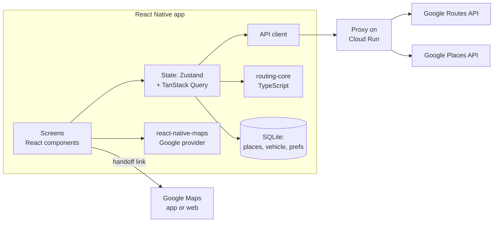
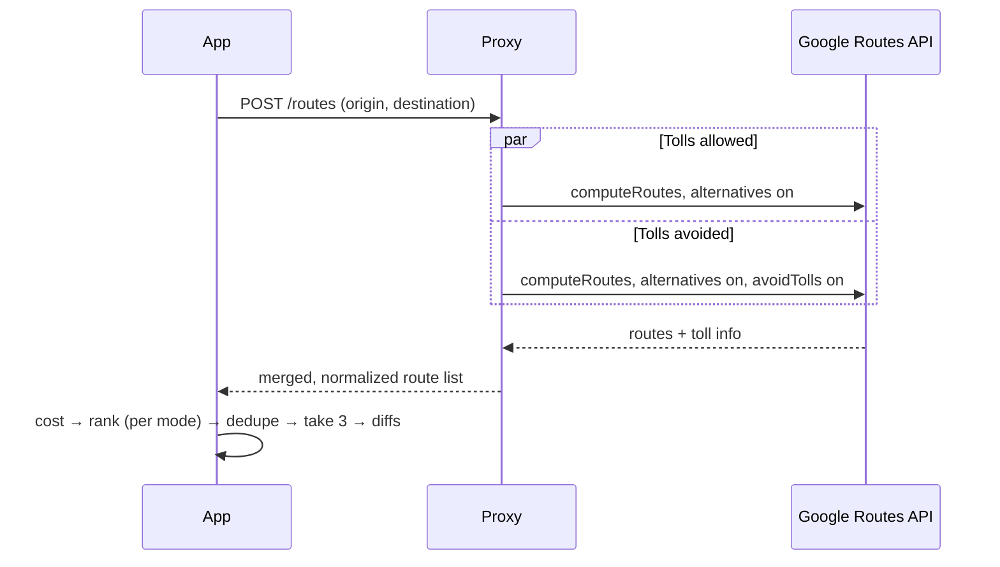
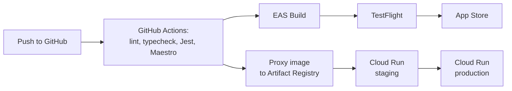

# Routes — Technical Design

Oct 5, 2026 · @Tony L

Related: [BRD](brd.md) (requirements) · [UX sketch](ux-sketch.md) (screens) · [Test plan](test-plan.md)

## Summary

Routes v1 is a React Native app built with Expo and shipped to iPhone. It gets routes, tolls and places from Google Maps Platform through a small proxy on Google Cloud, ranks them on the device, and hands off to Google Maps for navigation.

| Decision | Choice | Why |
|---|---|---|
| App stack | React Native, TypeScript (strict), Expo (dev builds, not Expo Go) | One codebase; Android later is mostly configuration, not a rewrite |
| Build and release | Expo Application Services: EAS Build, Submit, Update | Cloud iOS builds, App Store submission and over-the-air JS fixes |
| Routing and tolls | Google Routes API, `computeRoutes` | Returns alternative routes, traffic-aware durations, avoid-tolls and toll price estimates |
| Search | Google Places API (New): Autocomplete and Place Details | Same provider and IDs as routing; place IDs pass cleanly to the handoff |
| Map display | react-native-maps with the Google provider | Google's terms restrict showing Google route data on other maps; confirm in legal review |
| Navigation | Google Maps app or web link | No navigation engine to build (BRD non-goal) |
| Backend | Stateless proxy on Google Cloud Run | Keeps keys off the device, adds rate limits and caching; same cloud as the Maps APIs |
| Storage | On-device only, SQLite (expo-sqlite) | No accounts in v1 |

## Architecture

The app talks only to the Routes proxy for data; the map SDK and the handoff link talk to Google directly.



Ranking and cost math run on the device in a plain TypeScript package, so the vehicle profile and fuel price never leave the phone and the logic is testable without a simulator.

## Repository layout

npm workspaces at the repo root. Node 22 LTS.

```
/
├─ apps/
│  ├─ mobile/                 Expo app (see table below)
│  └─ proxy/                  Node/TypeScript service for Cloud Run (Fastify), Dockerfile
├─ packages/
│  ├─ routing-core/           Pure TS: decode, dedupe, cost, rank, diff, format. No RN/Node API deps.
│  └─ api-types/              Request/response types + zod schemas shared by app and proxy
├─ fixtures/                  Provider responses used by mock mode and tests
├─ docs/                      BRD, technical design, UX sketch, plan, test plan
└─ .github/workflows/         CI
```

| Folder (under `apps/mobile/`) | Responsibility | Key libraries |
|---|---|---|
| `app/` | One route per UX screen (1–5, S1–S3) with file-based navigation | Expo Router |
| `features/` | Screen components and hooks: onboarding, home, search, results, route detail, vehicle | React, React Native |
| `location/` | Permission flow, current location, reverse geocoding | expo-location |
| `api/` | Typed calls to the proxy; debouncing, caching and retries | TanStack Query, fetch |
| `storage/` | Places (recents, Home and Work), vehicle profile, preferences | expo-sqlite |
| `state/` | Current `TripRequest` and selected route | Zustand |
| `handoff/` | Google Maps link building, install check, share text | expo-linking, React Native Share |
| `i18n/` | Externalized strings (en-US only in v1, NFR-11) | i18n-js or equivalent |

State flows one way. The trip store holds a `TripRequest` (start, destination, mode). A TanStack Query hook fetches routes for it from the proxy; the query key excludes `mode`. routing-core then ranks the results into up to three `RouteOption` values for the screen. Switching Fastest/Cheapest re-ranks cached data locally, so the toggle feels instant and makes no network call.

Native pieces not covered by Expo modules, such as App Attest, go in small custom Expo modules. The app and proxy share request and response types through `packages/api-types`.

## Proxy API contract

All endpoints accept and return JSON. All requests carry two headers:

- `X-Device-Id`: a random UUID generated on first launch and stored on the device.
- `X-App-Attest`: an assertion, sent only when attestation is on.

Schemas live in `packages/api-types` as zod schemas; the proxy validates every request.

| Endpoint | Request | Response |
|---|---|---|
| `POST /routes` | `{ origin: Waypoint, destination: Waypoint }` where `Waypoint = { placeId?: string, lat: number, lng: number }` | `{ routes: ProviderRoute[] }`, the merged list from both calls |
| `GET /places/autocomplete` | `?q=&lat=&lng=&session=` (`lat`/`lng` = start, for distance and bias) | `{ suggestions: { placeId, primaryText, secondaryText, distanceMeters? }[] }` |
| `GET /places/details` | `?placeId=&session=` | `{ placeId, name, address, lat, lng }` |
| `GET /healthz` | none | `{ ok: true }` |

`ProviderRoute` has these fields:

```
{
  durationSec, distanceM, encodedPolyline, description,
  toll: { hasTolls: boolean, priceUSD: number | null },
  steps: { instruction, maneuver, distanceM }[],
  source: "tolls" | "avoidTolls"
}
```

The proxy normalizes Google's responses into this shape; the app never sees raw Google payloads.

Errors are returned as `{ error: { code, message } }`:

| Code | HTTP status | Meaning |
|---|---|---|
| `BAD_REQUEST` | 400 | Invalid request |
| `UNAUTHORIZED` | 401 | Attestation failed |
| `RATE_LIMITED` | 429 | Too many requests |
| `NO_ROUTE` | 404 | No driving route found |
| `UPSTREAM_ERROR` | 502 | Google returned an error |
| `UPSTREAM_TIMEOUT` | 504 | Google didn't respond within 8 s |

## Route pipeline

Each trip makes two `computeRoutes` calls in parallel, one allowing tolls and one avoiding them. This lets both Fastest and Cheapest be ranked from one fetch, and guarantees toll-free options for Cheapest.



If one of the two calls fails and the other succeeds, the proxy returns the successful one's routes. It fails only if both fail.

**Request settings** ([Routes API examples](https://developers.google.com/maps/documentation/routes/compute_route_directions))

- `travelMode: DRIVE`, `routingPreference: TRAFFIC_AWARE`, `computeAlternativeRoutes: true`, `units: IMPERIAL`, `languageCode: en-US`.
- `extraComputations: ["TOLLS"]`. This is required to get `travelAdvisory.tollInfo.estimatedPrice`.
- The second call adds `routeModifiers.avoidTolls: true`.
- Waypoints use `{ placeId }` when the place has one, else `{ location: { latLng } }`. Current location is always `latLng`.
- Later phase: pass the user's toll passes (`routeModifiers.tollPasses`) for pass pricing.
- Field mask (`X-Goog-FieldMask`): `routes.duration,routes.distanceMeters,routes.polyline.encodedPolyline,routes.description,routes.travelAdvisory.tollInfo,routes.legs.steps.distanceMeters,routes.legs.steps.navigationInstruction`.
- `routes.description` supplies the "via …" label.

**Toll normalization.** The Routes API reports tolls per route, not per step or by toll road name, so steps carry no toll data.

| Google response | Normalized `toll` |
|---|---|
| No `tollInfo` | `hasTolls: false` |
| `tollInfo` with one or more `estimatedPrice` entries in USD | `priceUSD = Σ (units + nanos / 1e9)` |
| `tollInfo` present but no USD price | `priceUSD: null` ("price unknown") |

**On-device processing (routing-core)**

1. **Cost:** `fuelUSD = (distanceM / 1609.344) / mpg × pricePerGallon` and `tripUSD = fuelUSD + tollUSD` (null if the toll is unknown). Keep full precision internally; round to cents only for display.
2. **Rank:**
   - Fastest sorts by `durationSec`, then `distanceM`.
   - Cheapest sorts priced routes by `tripUSD`, then `durationSec`. Unknown-price routes come after all priced routes, sorted by `durationSec`.
   - Both sources feed both modes.
3. **Dedupe:** walk the sorted list and drop a route whose overlap with any already-kept route exceeds `OVERLAP_THRESHOLD` (0.80). To compute overlap:
   - Decode both polylines.
   - Resample each route every 25 m.
   - A sample is shared if it lies within 20 m of the other route's polyline (point-to-segment distance, equirectangular approximation).
   - Overlap is the larger of the two shared fractions.
   - Constants are exported for tuning.
4. **Take three:** keep the first three and assign letters A, B, C in ranked order. Letters are reassigned when the mode changes.
5. **Differences:** compute each non-first card's difference from the first per [BRD business rule 4](brd.md#business-rules). Use cent-rounded trip costs and whole-minute durations (`Math.round(durationSec / 60)`), so the numbers shown add up. routing-core exports both the numbers and the formatted string.

routing-core also exports formatters:

| Formatter | Examples |
|---|---|
| Duration | "22 min", "1 hr 5 min" |
| Distance | "9.8 mi" (one decimal) |
| Money | "$5.15" |
| Toll status | "$3.75 toll", "No tolls", "Toll, price unknown" |

**Caching and debounce (NFR-9)**

- **App:** autocomplete is debounced 300 ms and needs at least 2 characters. TanStack `staleTime` is 5 min for autocomplete and 2 min for routes.
- **Proxy in-memory LRU:**

  | Request | TTL | Cache key |
  |---|---|---|
  | Routes | 60 s | Origin rounded to 4 decimals (~11 m), plus destination `placeId` or rounded latLng |
  | Autocomplete | 5 min | Query plus rounded origin |
  | Place details | 24 h | Place ID |

- Only the proxy's in-memory cache stores provider data. Confirm the durations against Google terms in legal review.

## Key steps (route detail)

- Show the first step, every step of at least 0.5 mi, and an arrival row. Cap at 8 rows, followed by a "Show all steps" row.
- Each row shows an icon derived from `maneuver`, the `navigationInstruction.instructions` text, and the step distance.
- The arrival row reads "Arrive at {destination name}" with the final step's distance.

## Google Maps handoff

The handoff uses Google's documented cross-platform directions link:

```
https://www.google.com/maps/dir/?api=1&origin=<lat,lng>&destination=<name>&destination_place_id=<id>&travelmode=driving&dir_action=navigate
```

- `origin`: the start's coordinates. Leave it out when the start is current location, so Google Maps uses the device location.
- `destination` + `destination_place_id`: the place name plus its Places ID, the most reliable way to land on the right place ([Maps URLs](https://developers.google.com/maps/documentation/urls/get-started)). If the destination is current location (after a swap), use `destination=<lat,lng>` with no place ID.
- `travelmode=driving`, `dir_action=navigate`: start turn-by-turn right away.
- All values are URL-encoded.
- Google Maps picks its own route, and the link carries no avoid-tolls option (accepted per the BRD).

An `https://` link always opens somewhere (Safari if the app is missing), so the app checks for Google Maps explicitly:

1. Call `Linking.canOpenURL("comgooglemaps://")`. This requires `comgooglemaps` in `ios.infoPlist.LSApplicationQueriesSchemes` in `app.config.ts`.
2. If it returns true, call `Linking.openURL(universalLink)`; iOS opens the Google Maps app.
3. If it returns false, or `openURL` rejects, show the [Google Maps isn't installed sheet](ux-sketch.md#s3--google-maps-isnt-installed-sheet):
   - "Open in browser" opens the same link.
   - "Get Google Maps" opens `https://apps.apple.com/app/id585027354`.

Link building, the install check and the share text live in `handoff/`. The platform calls are injected so the logic can be unit tested.

## Data model and storage

Three entities are stored on the device in SQLite; route results and the trip request live only in memory. Schema changes go through numbered migrations.

| Entity | Fields | Stored |
|---|---|---|
| Place | id, name, address, placeId, lat, lng, kind (`recent` \| `home` \| `work`), lastUsedAt | Recents (last 10) and saved Home/Work, SQLite |
| VehicleProfile | mpg, fuelType (`regular` \| `midgrade` \| `premium` \| `diesel`), pricePerGallon, tollPasses (later phase), isUserSet | SQLite, one record |
| Preferences | lastMode (`fastest` \| `cheapest`), locationPromptShown, cheapestVehiclePromptShown, deviceId | SQLite |
| RouteOption | id (A–C), polyline, durationSec, distanceM, viaLabel, tollUSD, tollUnknown, hasTolls, fuelUSD, tripUSD, steps, diff | Memory only |
| TripRequest | start (Place or `current`), destination (Place or `current`), mode | Memory only |

- Picking a destination upserts it as a recent (matched by `placeId`), updates `lastUsedAt`, and trims recents to 10.
- Clearing recents deletes `kind = recent` rows only.
- Nothing syncs off the device in v1.

## Proxy, security and privacy

The proxy is stateless and keeps no trip history; it exists to hide the API key and control cost.

**Proxy**

- A TypeScript (Node.js, Fastify) service on Cloud Run implementing the [contract above](#proxy-api-contract).
- Holds the Google API key server-side (`GOOGLE_MAPS_API_KEY` env var, from Secret Manager in deployed environments). The iOS map SDK uses a separate key restricted to the app's bundle ID.
- Requests are signed with App Attest so only the genuine app can call it. `ATTEST_MODE=enforce|off`; `off` is the default in development and CI.
- Per-device rate limits use an in-process token bucket keyed by `X-Device-Id`. Defaults per device per hour: 60 route requests and 600 autocomplete requests.
- A short-lived cache serves identical requests.
- Logs carry no coordinates, addresses or query text. They record only route, status, latency, cache hit and error code.

**Mock provider mode**

- `PROVIDER=mock` serves responses from `/fixtures` instead of calling Google, so the app and all automated tests run without Google keys or an Apple device.
- Fixtures are selected by destination place ID and cover:
  - the canonical trip, Current location → Union Station (see [UX screen 4](ux-sketch.md#screen-4--results))
  - only two routes
  - one route
  - an unknown toll price
  - near-duplicate routes
  - no route
  - upstream error
- `PROVIDER=google` is the default in deployed environments.

**Privacy**

- Location permission: When In Use only, requested after the onboarding explainer.
- Coordinates go to the proxy and Google only to compute routes and search.
- Vehicle profile, recents and saved places stay on the device.
- The App Store privacy label declares location and search queries shared with Google for app functionality, plus Sentry diagnostics.

## Hosting and deployment

The app ships to the App Store through Expo's build service, and the proxy runs on Google Cloud Run in the same Google Cloud project as the Maps Platform keys. There is no database server.

| Piece | Where it runs | How it ships |
|---|---|---|
| iOS app binary | Users' iPhones, via the App Store and TestFlight | EAS Build compiles on Expo's cloud Macs; EAS Submit uploads to App Store Connect |
| JavaScript updates | Expo's update service | EAS Update pushes JS and asset fixes without a new store build; native changes still need a build and review |
| Proxy API | Google Cloud Run, one US region | Container built in CI, stored in Artifact Registry, deployed to Cloud Run |
| API keys | Google Secret Manager | Injected into Cloud Run at deploy; never in the app bundle |
| Rate limiting | HTTPS load balancer with Cloud Armor in front of Cloud Run, plus in-process per-device limits | Per-IP and per-device limits (NFR-9) |
| Cache | In memory per Cloud Run instance in v1 | Move to Memorystore (Redis) if hit rates justify it |
| Monitoring | Cloud Logging and Monitoring (proxy); Sentry (app crashes and JS errors) | Budget and quota alerts on Maps Platform |

**Release pipeline**



- Merges to main deploy the proxy to staging and build a TestFlight version.
- Promoting to production is a manual approval for both.
- Deployment jobs are skipped when their secrets are absent, so CI stays green before the infrastructure exists.

**Environments**

- Three environments: development, staging, production. Each has its own Google Cloud project, API keys and proxy URL.
- The app reads `EXPO_PUBLIC_PROXY_URL` and `EXPO_PUBLIC_APP_ENV` via `app.config.ts`. In local development it points at `http://localhost:8080`, with the proxy in mock mode by default.
- EAS build profiles and update channels map one-to-one to those environments, so a TestFlight build always talks to staging.
- `EXPO_PUBLIC_MAP_PROVIDER=google|default`.
  - Staging and production use `google`, with the iOS Maps SDK key from `GOOGLE_MAPS_IOS_KEY`.
  - Development and CI may use `default` (Apple Maps), so simulator builds and E2E tests run without a Google key.
  - Shipped builds always use `google`.

**Scaling and cost**

- Cloud Run scales out with traffic. Production keeps [N] minimum instances warm so cold starts don't break the route-load target (NFR-1).
- Google Maps Platform calls are the main running cost; hosting is small next to them.
- Fixed costs are the Apple Developer Program (annual fee) and an EAS plan [PLAN].

AWS Lambda or Vercel would also work, but Cloud Run keeps billing, keys and quotas in one Google Cloud project.

## Errors, testing and open questions

Every failure shows a plain message with a retry, and routing-core carries most of the automated test coverage.

| Failure | What the user sees |
|---|---|
| No network | "You're offline" banner, retry; recents still usable |
| Location denied | Start field asks for an address; link to Settings |
| No route found (`NO_ROUTE`) | "No driving route found" with the destination kept |
| Fewer than 3 routes | The routes found, plus "Only N routes found" |
| Proxy or Google error | "Couldn't load routes" with retry; error code logged; map still shows start and destination pins |
| Rate limited (`RATE_LIMITED`) | "Too many requests. Try again in a minute." with retry |
| Google Maps not installed or link fails | "Google Maps isn't installed" sheet: open in browser or App Store |

**Testing** (details in the [test plan](test-plan.md))

- **routing-core:** Jest unit tests for dedupe, cost math, ranking ties, unknown toll prices, fewer than three routes, difference strings and formatters. Line coverage of at least 95%.
- **Proxy:** Jest plus supertest for request mapping, field mask, normalization, merge, partial failure, errors, cache, rate limit and log redaction. Google is stubbed with `nock`.
- **Screens:** React Native Testing Library, using fixture API responses.
- **End to end:** Maestro flows on the iOS simulator in CI, covering screens 1–5 and S1–S3 against the proxy in mock mode.
- **Manual:** handoff test with Google Maps installed and not installed.
- **Accessibility:** VoiceOver and largest Dynamic Type pass on every screen before beta.

**Open technical questions**

- [ ] Legal review of Google Maps Platform terms for display, caching and the proxy.
- [ ] Overlap threshold (proposed 80% / 20 m); tune on real trips.
- [ ] Expected monthly API cost at launch volume; set budget alerts.
- [ ] With production data, check whether one `computeRoutes` call returns enough distinct routes to drop the second call.

## Sources

- [Google Routes API — compute route examples](https://developers.google.com/maps/documentation/routes/compute_route_directions): alternatives, avoidTolls, toll info and toll passes.
- [Google Maps URLs](https://developers.google.com/maps/documentation/urls/get-started): directions link parameters for the handoff.
