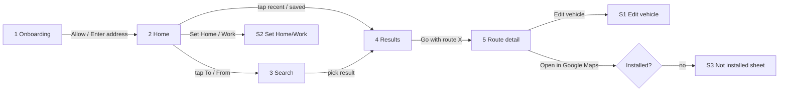
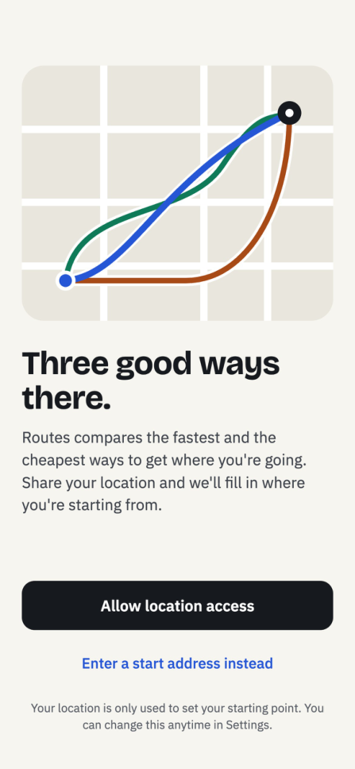
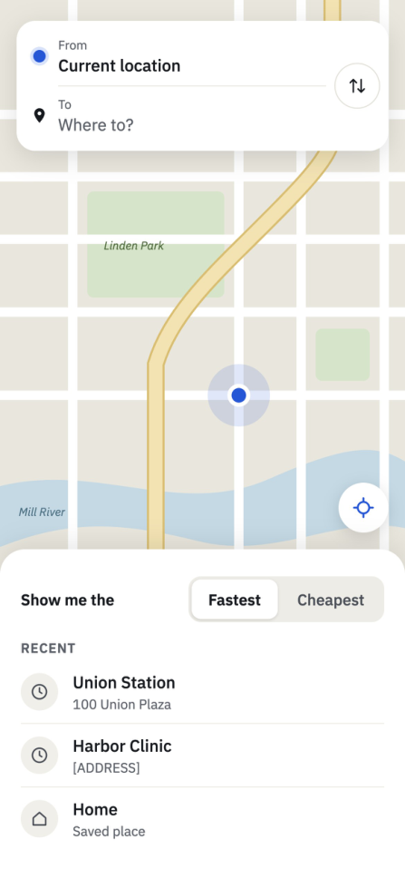
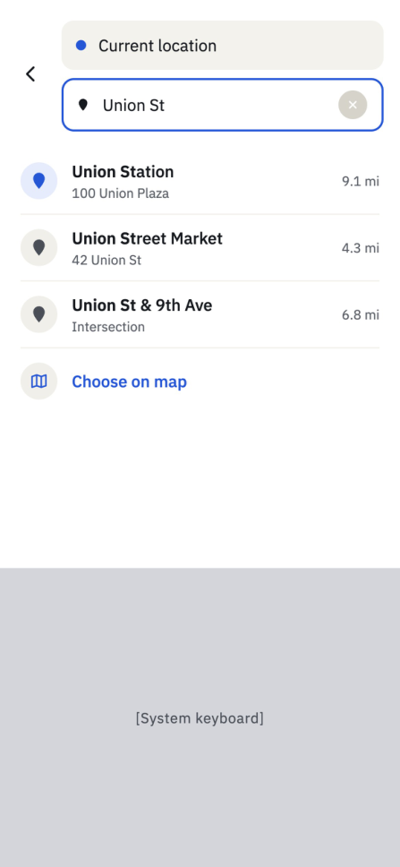
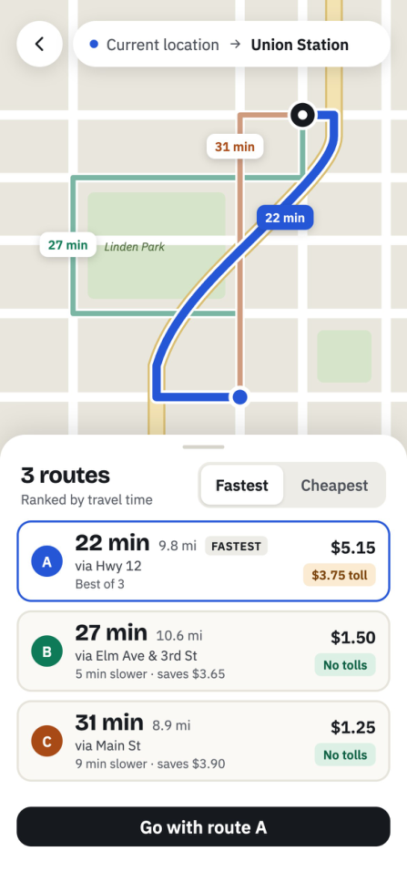
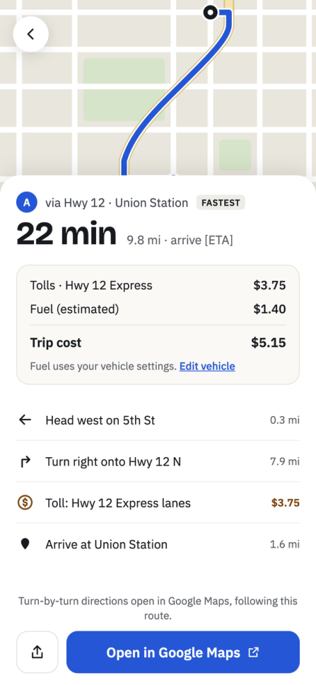

# Routes — UX Sketch

Oct 5, 2026 · @Tony L

Related: [BRD](brd.md) (requirements) · [Technical design](technical-design.md) (implementation)

The images are low-fidelity sketches of layout and visual style. The written spec under each image governs content, copy and behavior. Each screen notes where its sketch differs from the spec.

## Visual language

- Warm off-white background, near-black primary button, blue accent (links, selected route, current-location dot).
- Each route has its own color and letter: **A blue, B green, C orange/brown**.
  - The selected route is drawn thicker, on top, at full opacity; the others are lighter.
  - Colors have dark-mode variants, and all text meets a 4.5:1 contrast ratio (NFR-6).
- Bottom sheets with rounded top corners sit over a full-bleed map.
- Durations are large and bold; secondary text is grey.
- Toll pills:

  | Pill | Color | Text |
  |---|---|---|
  | Priced toll | Amber | "$3.75 toll" |
  | No toll | Green | "No tolls" |
  | Unknown price | Amber | "Toll, price unknown" |

- Figures in the sketches are illustrative. Real values come from the cost formula and vehicle defaults (25 mpg, $3.50/gal).

## Flow

Onboarding shows only on first launch (`locationPromptShown`). After that, the app opens on Home.

---

## Screen 1 — Onboarding (FR-1, US-1, US-2)

- Illustration, then the title "Three good ways there." and the body copy shown.
- **Allow location access** shows the iOS "While Using the App" prompt (NFR-4), then goes to Home. The app continues to Home whether the user grants or denies.
- **Enter a start address instead** goes to Home and opens Search for the From field. The system prompt is not shown.
- Footnote: "Your location is only used to set your starting point. You can change this anytime in Settings."
- The iOS prompt is never shown before this screen (FR-1).

## Screen 2 — Home (FR-2, 3, 4, 6, 7, 11, 21)

- **Map** centered on the current location (blue dot). The re-center button is at the bottom right.
- **From/To card:**
  - From shows "Current location". Its accessibility label includes the reverse-geocoded street address (FR-2).
  - To shows the placeholder "Where to?".
  - Tapping either field opens Search for that field.
  - The swap button swaps From and To (FR-4).
- **Mode toggle:** "Show me the Fastest | Cheapest", defaulting to the last used mode (FR-11).
- **Recents:**
  - The RECENT header has a **Clear** action on the right. It confirms with "Clear recent destinations?", then removes recents but keeps saved places (FR-6).
  - Rows show the place name and address, most recent first, up to 10.
- **Saved places:**
  - **Home** and **Work** rows sit below the recents.
  - A saved place shows its address. An unsaved one shows "Set Home" or "Set Work" and opens S2 (FR-7).
- Tapping a recent or saved row goes straight to Results when a start is set (one tap, US-4).
- *Sketch differences:* the sketch shows the Home row labelled "Saved place" and omits Work and the Clear action. The spec above governs.

**States**

- **Location denied or unavailable (FR-3):**
  - From shows the placeholder "Enter a start address".
  - An inline note below the card reads "Location is off. **Turn on in Settings**". The link opens `app-settings:`.
  - No blue dot. The map centers on the last known region, or on the continental US if there is none.
- **Locating:** From shows "Finding your location…" until the first fix. After a 5 s timeout, the screen behaves as if location is unavailable.
- **Offline (FR-21):**
  - A banner below the card reads "You're offline", with a **Retry** button.
  - Recents and saved places stay listed and tappable; Results then shows its offline state.

## Screen 3 — Search (FR-5, US-3)

- The other endpoint appears above, read-only. The active field is focused with a clear (×) button. Back returns to Home.
- Before the user types, the list shows recents and saved places.
- Suggestions appear after 2 characters, debounced 300 ms.
  - Rows show the name, secondary text and distance from the start, e.g. "9.1 mi" (FR-5).
  - Distance is hidden when the start is unknown.
- Picking a result fetches its details and saves it as a recent.
  - If both endpoints are now set, go to Results.
  - Otherwise, return to Home with the field filled.
- *Sketch difference:* the "Choose on map" row is a later-phase feature and is not built in v1.

**States**

- **No results:** "No places match '…'".
- **Error or offline:** "Search isn't available right now" with **Retry**.
- **Loading:** a subtle spinner in the field.

## Screen 4 — Results (FR-8 to FR-14, FR-20, FR-22, US-5 to US-7)

- **Header pill:** "{start} → {destination}", with a back button to Home.
- **Map (FR-12, FR-14):**
  - All routes are drawn in the route colors, with start and end markers.
  - Each route has a bubble near its middle showing letter and time, e.g. "A · 22 min" (NFR-7).
  - The camera fits all routes above the bottom sheet.
  - Tapping a route line selects that route.
- **Sheet header:**
  - Title: "3 routes", or "Only N routes found".
  - Subtitle: "Ranked by travel time" (Fastest) or "Ranked by trip cost" (Cheapest).
  - The Fastest | Cheapest toggle re-ranks instantly with no reload, re-letters the routes, and selects the new A.
- **Route cards (FR-13):**
  - **Left:** letter badge in the route color.
  - **Middle:**
    - Duration (large), distance, and the FASTEST/CHEAPEST badge on the first card only.
    - "via {description}".
    - A third line: "Best of 3" (or "Best of N") on the first card; on the others, the difference string, e.g. "5 min slower · saves $3.65".
  - **Right:**
    - Trip cost with "est." (FR-20); for an unknown toll, "$1.37 + toll".
    - The toll pill below the cost.
  - The selected card has a blue outline. Tapping a card selects it (FR-14).
  - VoiceOver label example: "Route A, fastest, 22 minutes, 9.8 miles, via Hwy 12, estimated cost $5.15 including $3.75 toll".
- **Primary button:** "Go with route {selected letter}" opens Route detail.
- **Vehicle prompt (FR-22):**
  - The first time Cheapest is viewed with no vehicle set, a dismissible banner appears above the cards: "Using 25 mpg at $3.50/gal. **Set your vehicle**".
  - The link opens S1.
  - The banner never shows again once dismissed or once a vehicle is set.
- *Sketch differences:* the map bubbles in the sketch show time only, and the card costs lack "est.". The spec above governs.

The sketch's trip is the canonical test fixture, Current location → Union Station:

| Route | Duration | Distance | Via | Toll |
|---|---|---|---|---|
| 1 | 22 min | 9.8 mi | Hwy 12 | $3.75 |
| 2 | 27 min | 10.6 mi | Elm Ave & 3rd St | none |
| 3 | 31 min | 8.9 mi | Main St | none |

**States**

- **Loading:** skeleton cards; the map shows start and destination pins, fitted.
- **No route:** "No driving route found" with **Change destination**. The destination stays in the pill.
- **Error:** "Couldn't load routes" with **Retry**. The map still shows the pins and is never blank (NFR-8).
- **Offline:** "You're offline" with **Retry**.
- **Rate limited:** "Too many requests. Try again in a minute." with **Retry**.

## Screen 5 — Route detail (FR-15 to FR-18, FR-20, US-8, US-9)

- The map shows only the selected route. Back returns to Results with the same selection.
- **Header:**
  - Letter badge, "via {description} · {destination name}", and the badge if this is the first route.
  - Duration (large), then "{distance} · arrive {h:mm AM/PM}". Arrival = now + duration, refreshed each minute.
- **Cost breakdown card:**
  - "Tolls" with the amount, "No tolls", or "Price unknown".
  - "Fuel (estimated)" with the amount.
  - A divider, then "Trip cost (estimated)" with the total, or "$X.XX + toll".
  - Footnote when the vehicle is set: "Fuel uses your vehicle settings. **Edit vehicle**", opening S1.
  - Footnote on defaults: "Fuel uses default settings (25 mpg, $3.50/gal). **Set your vehicle**".
- **Key steps:**
  - Up to 8 rows plus "Show all steps" (rules in the [technical design](technical-design.md#key-steps-route-detail)).
  - Each row has a maneuver icon, the instruction and the distance.
- **Handoff note:**
  - "Directions open in Google Maps, which may pick a different road."
  - When the route has no tolls, add: "To keep this route toll-free, turn on Avoid tolls in Google Maps."
- **Share** (FR-18) opens the iOS share sheet with text like:
  > Route A via Hwy 12 to Union Station: 22 min, 9.8 mi, est. $5.15 (incl. $3.75 toll). https://www.google.com/maps/dir/?api=1&…
- **Open in Google Maps** follows the handoff flow (FR-16, FR-17).
- *Sketch differences:*
  - The toll line is labelled just "Tolls".
  - The steps list has no toll row, because the routing provider reports tolls per route, not per step.
  - The handoff note uses the copy above.

---

## S1 — Edit vehicle (FR-19, US-10)

A pushed screen titled "Your vehicle".

| Field | Control | Validation | Default |
|---|---|---|---|
| Fuel economy | Numeric field, suffix "mpg" | 5–150, up to 1 decimal | 25 |
| Fuel type | Segmented: Regular · Midgrade · Premium · Diesel | required | Regular |
| Fuel price | Currency field, prefix "$", suffix "/gal" | $0.50–$15.00, 2 decimals | 3.50 |

- Helper text: "Used to estimate fuel cost. Fuel prices aren't updated automatically."
- Inline errors appear under invalid fields, and **Save** is disabled while any field is invalid.
- Save marks the vehicle as set and returns to the previous screen. Costs and rankings update immediately.

## S2 — Set Home / Work (FR-7)

- Reuses Search (screen 3), titled "Set Home" or "Set Work". Picking a result saves it and returns to Home.
- Long-pressing or swiping a saved Home or Work row shows **Change** and **Remove**.

## S3 — Google Maps isn't installed (sheet) (FR-17)

- Title: "Google Maps isn't installed".
- Body: "Open this route in your browser, or get the Google Maps app."
- Buttons: **Open in browser** (primary), **Get Google Maps** (opens the App Store), **Cancel**.

## Accessibility checklist (every screen; NFR-6, NFR-7)

- Every control has an accessibility label and role. Route cards and route lines include the letter.
- Layout holds at the largest Dynamic Type size with no truncated numbers, and the sheet scrolls.
- Touch targets are at least 44 × 44 pt.
- Text contrast is at least 4.5:1 in light and dark modes.
- The mode toggle reads as a segmented control and announces the selected state.
